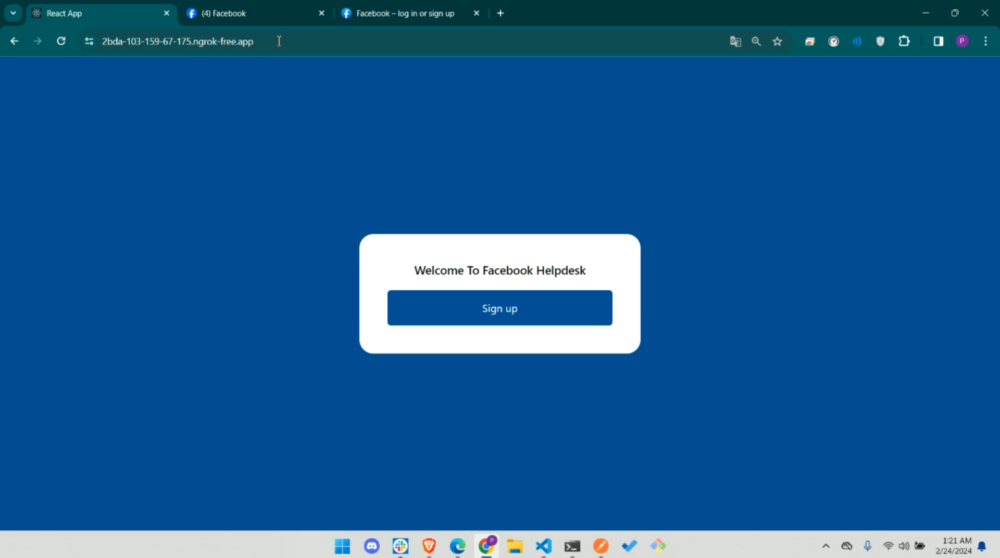
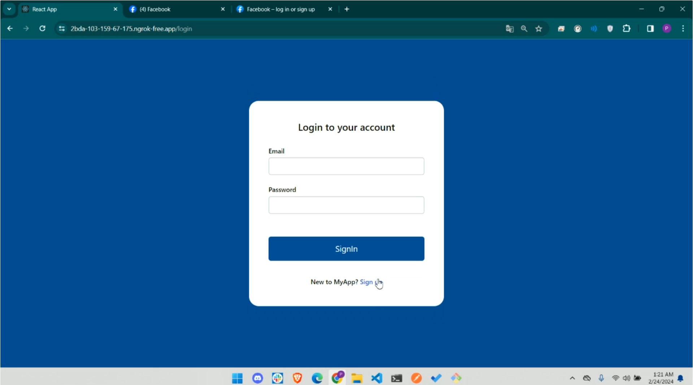
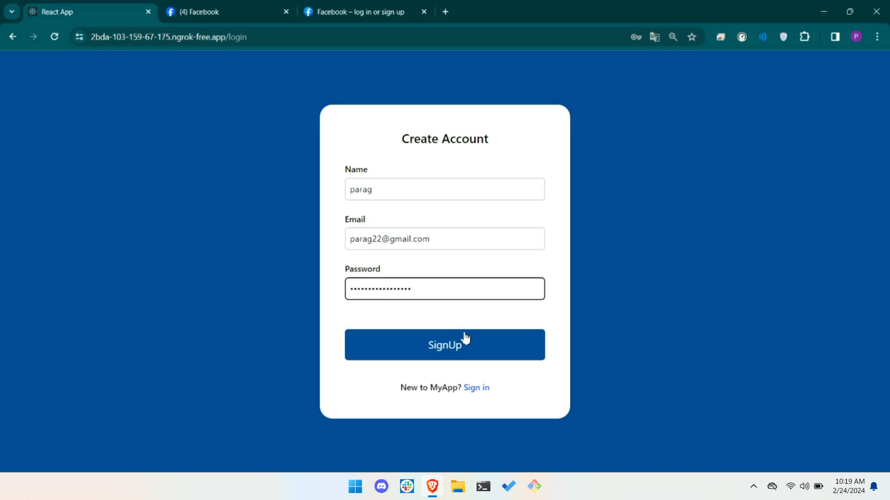
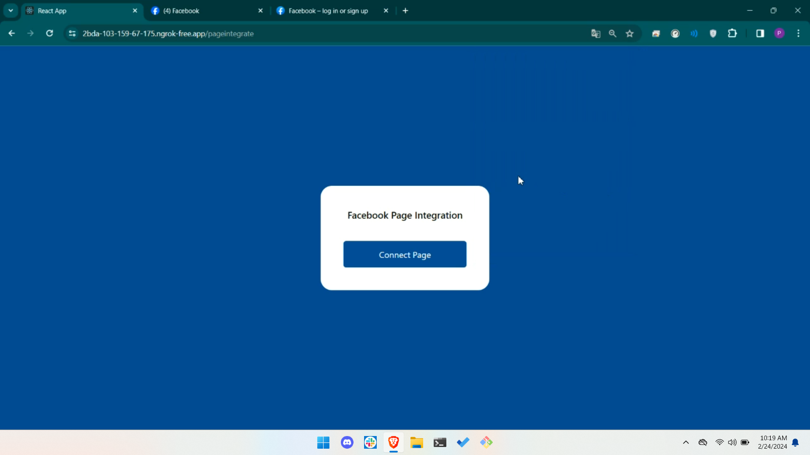
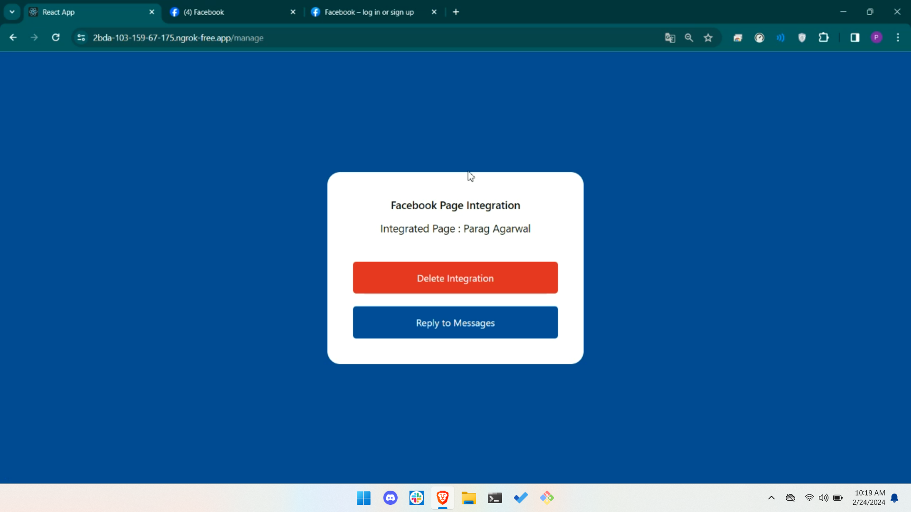
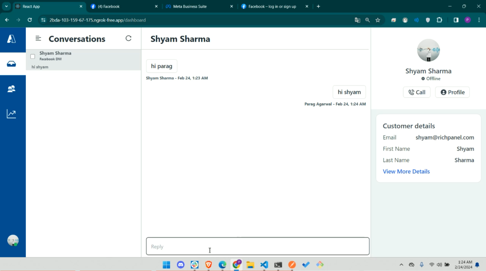

  <!-- Dependency Status -->
<h1>Facebook Helpdesk</h1>
 
## Backend Repository
<a href="https://github.com/Parag589/FB-Help-Desk-Backend">
    https://github.com/Parag589/FB-Help-Desk-Backend
  </a>  

## Demo Video
<a href="https://www.loom.com/share/76f952fc2716451cab46d9c8f94bb9c1">
    https://www.loom.com/share/76f952fc2716451cab46d9c8f94bb9c1
  </a>  

## Landing Page
  
    

## Login Page

  
  

## Signup Page

  

## Connect Facebook Page

  
  

## Manage Integrated Facebook Page

  

## Dashboard Page

  

  

## My Portfolio
<a href="https://paragportfolio.vercel.app/">
    https://paragportfolio.vercel.app/
  </a>

